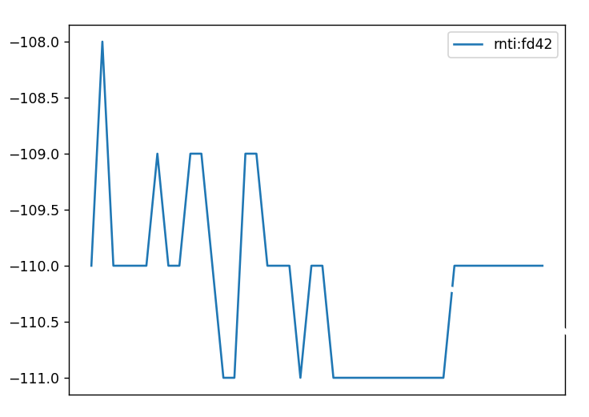

# OAIBOX Data Subscriber

## Script to demonstrate OAIBOX data output by either saving to a file or visualizing a plot updated overtime.

### Step-by-step guide:

**1.** Run main.py. This can be done using an IDE (***1.1.***) or by running main.py in a terminal (***1.2.***).

&emsp;***1.1.*** IDEs will direct you to install the libs necessary to run this program once you run main.py.

&emsp;***1.2.*** To run in a terminal, first you will need Python 3 installed. (You can check what Python version you are currently running by running the command ```python -version```)

&emsp;***1.2.1.*** Before you run the script, a few dependencies need to be installed, first, navigate to the oaibox-data-subscriber directory, and then use the command ```pip install -r requirements.txt```.

&emsp;***1.2.2.*** Once the requirements installation has finished, in the same directory run the command ```python main.py```

**2.** Once the program is running you will be propmpted to insert your username and password, go ahead and insert those:
```
Insert username: example@oaiboxexample.com
Insert password: *************************
```
**3.** After the authentication process is finished successfully, the machines available to the authenticated user will be displayed and the user is prompted to choose (by inputting the index) which machine's data is required.
```
You have the following machines available:
0 - OAIBOX_DESCRIPTION_1 - OAIBOX_TYPE_1 [r4nd0m1d-1234-5678-9101-n07r34l1d1]
1 - OAIBOX_DESCRIPTION_2 - OAIBOX_TYPE_2 [r4nd0m1d-1324-5678-9101-n07r34l1d2]
2 - OAIBOX_DESCRIPTION_3 - OAIBOX_TYPE_3 [r4nd0m1d-4321-5678-9101-n07r34l1d3]
Select the index of the machine you want to subscribe data from:
```
**4.** When the user inputs a correct index (let's say '1'), there will be one final prompt:
```
Would you like to save the data to a file? (Y/N):
```
&emsp;***4.1.*** If 'y' is selected, the data will begin recording, and once the user terminates the program by pressing CTRL+C, the data accumulated will be stored in a CSV file.

&emsp;&emsp;*Note:* A sample of the data file stored can be checked here: [Sample.csv](output/sample.csv)

&emsp;***4.2.*** If 'n' is selected, a plot updated every second will display the rsrp of the UEs connected to the selected machine (demonstrated in the image below) until the program is terminated by pressing CTRL+C.

&emsp;&emsp;
